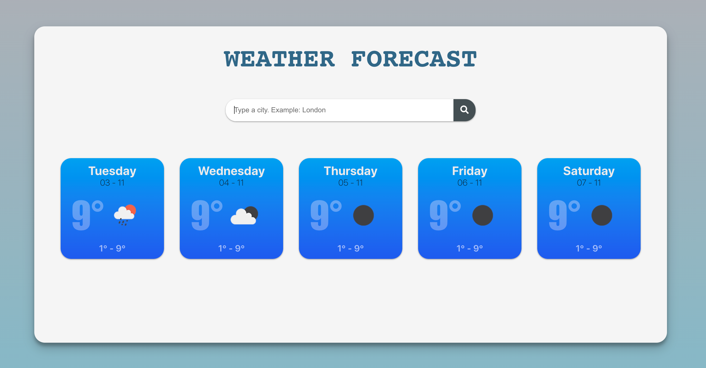

# Weather forecase develope by Phong Ho -  NAB test
Using openweathermap.org API

## Features
- UI: 
    + Can do search weather by type a city
    + Display background color of weather base on the degree: Cold - Blue, Good - Green, Hot - Red
    + Have css placeholder

- Coding:
    + Config jest, babel, enzyme, typescript, redux saga, eslint, husky
    + Using redux saga to manage state
    + Full unit test for all modules (UI & Redux)

## Available Scripts

In the project directory, you can run:

### `yarn install`

To install nessesary library.

### `yarn start`

Runs the app in the development mode.\
Open [http://localhost:3000](http://localhost:3000) to view it in the browser.

The page will reload if you make edits.\
You will also see any lint errors in the console.

### `yarn test`

Launches the test runner in the interactive watch mode.\

### `yarn build`

Builds the app for production to the `build` folder.\
It correctly bundles React in production mode and optimizes the build for the best performance.
